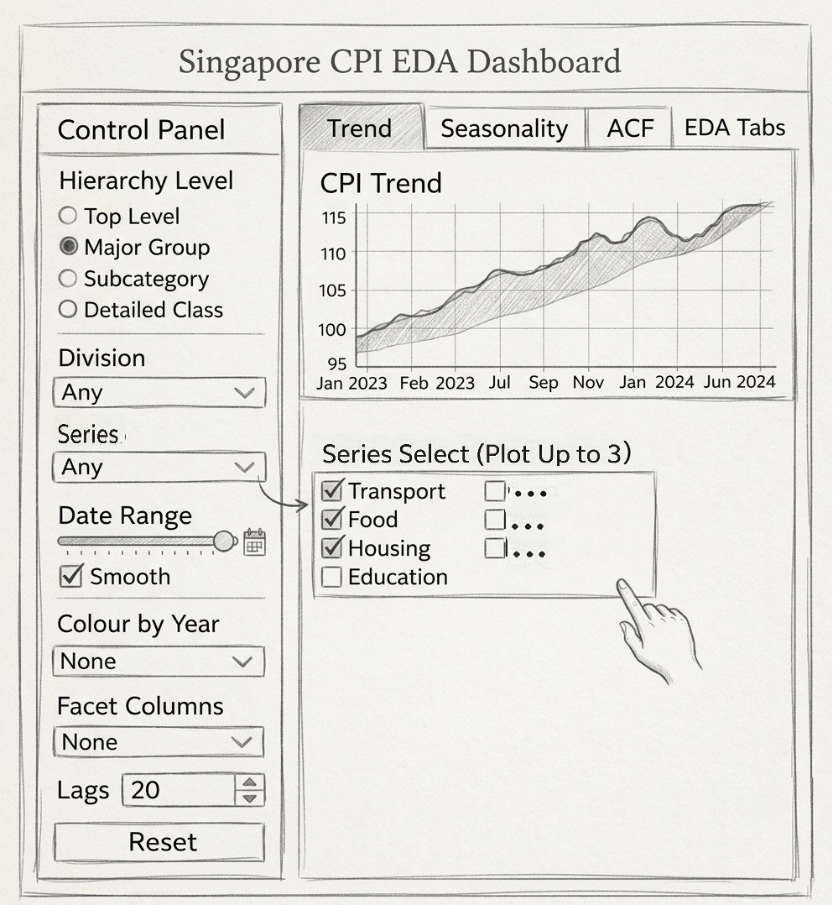
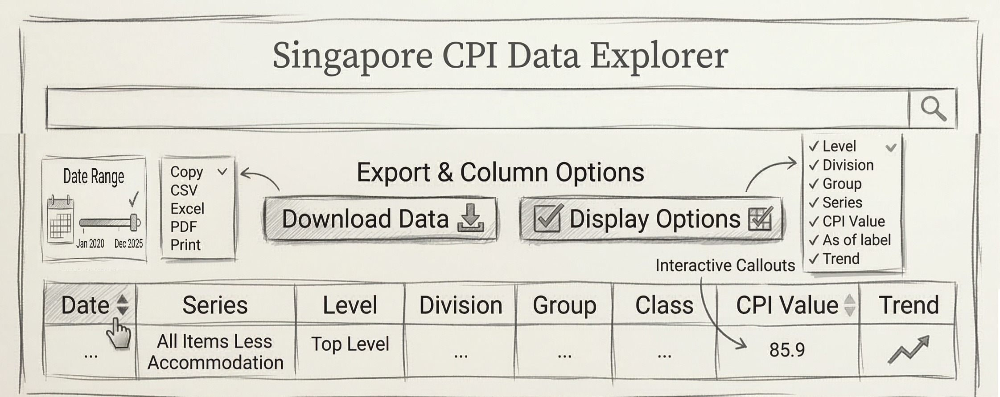
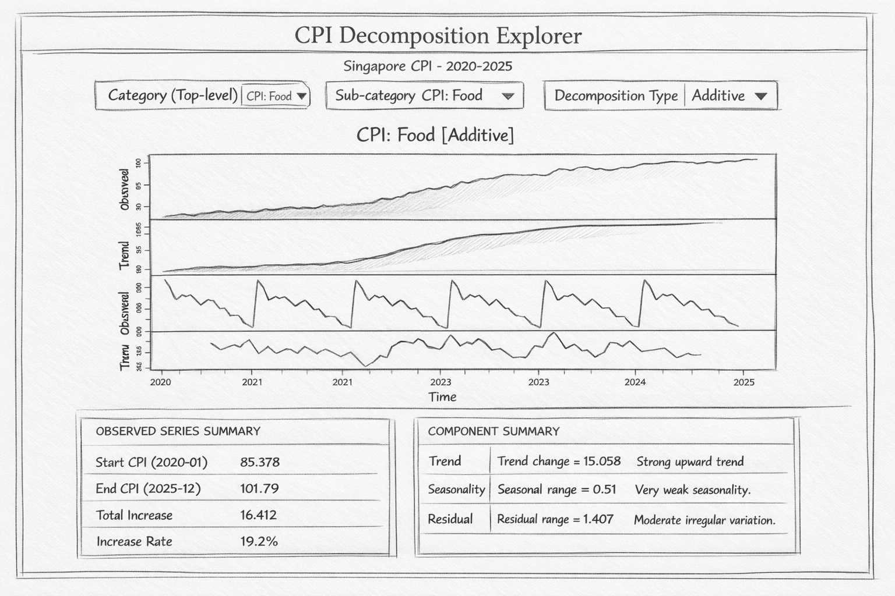

# **1. Home Module**

## **1.1 Objective**

The Home module serves as the landing page of the application. It introduces the project background, explains the significance of Singapore’s CPI, and provides users with a clear entry point to the main analytical modules of the application.

## **Storyboard Reference**

The interface includes the project title, a short project description, summary cards for data coverage and forecasting models, and navigation buttons linking to the main analytical modules.

## **1.3 User Interaction**

Users can read the overview and navigate directly to the Data Explorer, Decomposition, or Forecasting module.

## **1.4 Expected Output**

Users gain an initial understanding of the project scope, data coverage, and analysis workflow before exploring the detailed modules.

# **2. Data Explorer Module**

## **2.1 Objective**

This module enables users to explore historical Singapore CPI data across different CPI hierarchy levels and categories. It provides interactive visualisations and summary indicators that allow users to examine CPI trends, compare categories, and identify major contributors to inflation before performing deeper time-series analysis.

## **2.2 Data Preparation**

The CPI dataset is obtained from CEIC and contains monthly CPI indices for Singapore across multiple categories. The raw dataset is reshaped into a long format to facilitate interactive filtering and visualisation.

The data preparation process includes:

-   **transforming the dataset into long format**

-   **converting the date variable into monthly time format**

-   **ensuring the time series is complete**

-   **imputing missing observations when necessary**

This structure allows the data to be filtered dynamically by category, hierarchy level, and date range within the Shiny application.

### **2.2.1 Import Packages**

```{r}
pacman::p_load(readxl, tidyverse, timetk, 
               modeltime, tidymodels, 
               lubridate, anomalize, plotly, shiny)
```

### **2.2.2 Import Data**

```{r}
cpi_data_raw <- read_excel("SG_CPI_012020_012026_Use.xlsx")
```

### **2.2.3 Data Transformation**

```{r}
#| message: false
#| warning: false
cpi_data_long <- cpi_data_raw %>%
  pivot_longer(
    cols = -Date,
    names_to = "Category",
    values_to = "CPI_Value"
  ) %>%
  mutate(Date = floor_date(as.Date(Date), "month")) %>%
  group_by(Category) %>%
  arrange(Date) %>%
  pad_by_time(.date_var = Date, .by = "month") %>%
  mutate(CPI_Value = ts_impute_vec(CPI_Value, period = 1)) %>%
  fill(CPI_Value, .direction = "downup") %>%
  ungroup()
```

## **2.3 UI Design**

```{=html}
<h2>Prototype</h2>
<p>The following shows the prototype of the R Shiny application that will be developed.</p>

<div style="display:flex; gap:20px; margin-top:1rem;">

  <div style="flex:1;">
    
    <p style="font-size:0.85rem; color:#7a6f68; margin-top:0.4rem;">
      Prototype of the CPI exploratory dashboard.
    </p>
  </div>

  <div style="flex:1;">
    
    <p style="font-size:0.85rem; color:#7a6f68; margin-top:0.4rem;">
      Prototype of the CPI data table explorer with export options.
    </p>
  </div>

</div>
```

The Data Explorer module is designed as an interactive dashboard that allows users to explore CPI patterns across categories and time periods.

The interface consists of two main sections: a **Control Panel** and a **Main Visualisation Panel**.

### **2.3.1 Control Panel**

The control panel allows users to configure the analysis through several interactive inputs. These include:

-   **Hierarchy Level Selection** – Allows users to select the CPI hierarchy level, including *Top Level*, *Major Group*, *Subcategory*, or *Detailed Class*.

-   **Division Selector** – Filters CPI categories within a specific division.

-   **Series Selector** – Allows users to choose up to three CPI series for comparison.

-   **Date Range Filter** – A slider control that enables users to select the time period for analysis.

-   **Smoothing Option** – Allows optional smoothing of the CPI trend line.

-   **Colour by Year** – Enables users to colour the time-series plot by year.

-   **Facet Columns** – Allows multiple CPI series to be displayed across facets.

-   **Lag Selection** – Controls the number of lags used in the ACF analysis.

-   **Reset Button** – Restores all filters to their default values.

### **2.3.2 Main Visualisation Panel**

The main visualisation panel presents the outputs of the exploratory analysis. It includes a tab-based layout for trend, seasonality, and autocorrelation views, as well as a raw data table with export and column display options.

# **3. Time Series Decomposition**

## **3.1 Objective**
The objective of this module is to analyse the structural components of Singapore CPI time series. 
Time series decomposition separates the observed series into three interpretable components: 
trend, seasonality, and remainder. 

Understanding these components helps identify long-term inflation patterns, recurring seasonal 
effects, and irregular shocks before applying forecasting models.

## **3.2 STL Decomposition**
Seasonal and Trend decomposition using Loess (STL) is applied to all CPI series. STL is robust to outliers and is suitable for CPI data because it can accommodate changing seasonal patterns over time, especially during periods affected by structural shocks such as the COVID-19 pandemic.

Each CPI variable is converted into a monthly time series starting from January 2020 with a frequency of 12 observations per year. STL decomposition is then applied to separate the series into its trend, seasonal, and remainder components.

```{r}
data <- cpi_data_raw
cpi_cols <- names(data)[names(data) != "Date"]

knitr::kable(data.frame(CPI_Series = cpi_cols),
             caption = "List of CPI series used in the analysis")

cpi_cols <- names(data)[sapply(data, is.numeric)]

stl_list <- list()

for (col in cpi_cols) {
  ts_data <- ts(data[[col]], start = c(2020, 1), frequency = 12)
  stl_list[[col]] <- stl(ts_data, s.window = "periodic")
}
```

## **3.3 Observed Series Summary**
To provide a concise overview of the observed CPI series, summary statistics are calculated for each category. These include the starting value in January 2020, the ending value in December 2025, the total increase, and the percentage increase over the study period.

```{r}
table1_list <- list()

for (col in cpi_cols) {
  ts_data <- ts(data[[col]], start = c(2020, 1), frequency = 12)

  start_value    <- ts_data[1]
  end_value      <- tail(ts_data, 1)
  total_increase <- end_value - start_value
  increase_rate  <- (total_increase / start_value) * 100

  table1_list[[col]] <- data.frame(
    CPI    = col,
    Metric = c(
      "Start CPI (2020-01)",
      "End CPI (2025-12)",
      "Total Increase",
      "Increase Rate"
    ),
    Value  = c(
      round(start_value, 3),
      round(end_value, 3),
      round(total_increase, 3),
      paste0(round(increase_rate, 1), "%")
    )
  )
}

knitr::kable(table1_list[[1]])
```

## **3.4 Decomposition Analysis and Interpretation**
The magnitude of the trend, seasonal, and remainder components is measured and normalised by the mean of each series. Based on these ratios, the decomposition results can be interpreted in terms of the relative strength of long-term trend, seasonal movement, and irregular fluctuation.

```{r}
table2_list <- list()

for (col in cpi_cols) {

  ts_data <- ts(data[[col]], start = c(2020, 1), frequency = 12)
  fit     <- stl(ts_data, s.window = "periodic")

  trend_vals    <- na.omit(as.numeric(fit$time.series[, "trend"]))
  seasonal_vals <- na.omit(as.numeric(fit$time.series[, "seasonal"]))
  residual_vals <- na.omit(as.numeric(fit$time.series[, "remainder"]))

  trend_change   <- tail(trend_vals, 1) - head(trend_vals, 1)
  seasonal_range <- max(seasonal_vals) - min(seasonal_vals)
  residual_range <- max(residual_vals) - min(residual_vals)

  series_mean <- mean(ts_data, na.rm = TRUE)

  trend_ratio    <- abs(trend_change) / series_mean
  seasonal_ratio <- seasonal_range / series_mean
  residual_ratio <- residual_range / series_mean

  table2_list[[col]] <- data.frame(
    CPI = col,
    Trend_Change = round(trend_change, 3),
    Seasonal_Range = round(seasonal_range, 3),
    Residual_Range = round(residual_range, 3),
    Trend_Ratio = round(trend_ratio, 3),
    Seasonal_Ratio = round(seasonal_ratio, 3),
    Residual_Ratio = round(residual_ratio, 3)
  )
}

knitr::kable(
  table2_list[[1]],
  caption = "STL Decomposition summary for one CPI series"
)
```

## **3.5 Key Findings**
The decomposition results show that the trend component exhibits a visible structural break around mid-2021, reflecting post-pandemic inflationary pressures and supply chain disruptions. Seasonal variation is particularly noticeable in categories such as food and beverages, where recurring patterns are observed around the January–February Lunar New Year period and the June–August school holiday season.


## **3.6 UI Design**

```{=html}
<p>The following shows the prototype of the Time Series Decomposition module in the proposed R Shiny application.</p>

<div style="display:flex; justify-content:center; margin-top:1rem;">

  <div style="width:85%;">
    
    <p style="font-size:0.85rem; color:#7a6f68; margin-top:0.4rem; text-align:center;">
      Prototype of the CPI time series decomposition dashboard.
    </p>
  </div>

</div>
```

The **Decomposition module** is designed to help users understand the structural components of CPI time series before applying forecasting models. The interface allows users to interactively explore the **trend**, **seasonal**, and **remainder** components generated from STL decomposition.

The interface consists of two main sections: a **Control Panel** and a **Decomposition Visualisation Panel**.

### **3.6.1 Control Panel**

The control panel allows users to configure the decomposition analysis using several interactive inputs:

- **CPI Series Selector** – Allows users to choose the CPI category or sub-index to analyse.

- **Decomposition Method Selector** – Allows users to choose the decomposition method (e.g., STL).

### **3.6.2 Decomposition Visualisation Panel**

The visualisation panel displays the decomposition results of the selected CPI series. The output typically includes:

- **Observed Series Plot** showing the original CPI time series.

- **Trend Component Plot** showing the long-term movement of CPI.

- **Seasonal Component Plot** illustrating recurring seasonal patterns.

- **Remainder Component Plot** capturing irregular fluctuations that are not explained by trend or seasonality.

These interactive plots allow users to visually inspect how inflation dynamics evolve over time and identify structural shifts or seasonal patterns in different CPI categories.

# **4. Forecasting**

## **4.1 Module Objective**
The objective of the Forecasting module is to generate reliable predictions of Singapore CPI using multiple time-series forecasting models. 

This module compares several forecasting approaches, including classical statistical models and machine learning methods, to evaluate their forecasting performance. 

By comparing models using evaluation metrics such as RMSE, MAE, and MASE, the best-performing model for each CPI series is selected and used to generate future forecasts.

## **4.2 Data Preparation**
Before model training, the CPI dataset is reshaped into a long format to allow modelling across multiple CPI categories. 

The time series is padded to ensure continuous monthly observations and missing values are imputed where necessary. This ensures that each CPI category can be modelled consistently within the forecasting pipeline.

```{r}
cpi_data_long <- cpi_data_raw %>%
  pivot_longer(
    cols = -Date,
    names_to = "Category",
    values_to = "CPI_Value"
  ) %>%
  mutate(Date = as.Date(Date)) %>%
  arrange(Category, Date)
```

## **4.3 Forecasting Models**
Four forecasting models are implemented and compared in this module. Each model captures different characteristics of time series data.
```{=html}
<table class="proposal-table">
<thead>
<tr>
<th>Model</th>
<th>Type</th>
<th>Description</th>
</tr>
</thead>
<tbody>
<tr>
<td>ETS</td>
<td>Classical</td>
<td>Exponential smoothing model capturing trend and seasonality</td>
</tr>
<tr>
<td>Auto-ARIMA</td>
<td>Classical</td>
<td>Automatically selects optimal ARIMA parameters</td>
</tr>
<tr>
<td>ARIMA + XGBoost</td>
<td>Hybrid</td>
<td>Combines ARIMA with machine learning residual modelling</td>
</tr>
<tr>
<td>Prophet</td>
<td>Additive Regression</td>
<td>Robust forecasting model designed for business time series</td>
</tr>
</tbody>
</table>
```

## **4.4 Model Training**
Each forecasting model is trained on historical CPI data. The training dataset includes observations up to the selected cutoff date, while the remaining observations are used as a test set for evaluation.

```{r}
train_data <- cpi_data_long %>%
  filter(Date <= as.Date("2025-01-01"))

test_data <- cpi_data_long %>%
  filter(Date > as.Date("2025-01-01"))
```

## **4.5 Model Evaluation**
Forecasting models are evaluated using multiple accuracy metrics to ensure reliable predictions. The evaluation focuses on how closely the predicted CPI values match the observed values in the test dataset.

### **4.5.1 Evaluation Metrics**

The forecasting models are evaluated using the following performance metrics:

- **RMSE (Root Mean Squared Error):** measures the average magnitude of prediction errors, with larger errors receiving greater penalty.
- **MAE (Mean Absolute Error):** measures the average absolute difference between actual and predicted values.
- **MASE (Mean Absolute Scaled Error):** provides a scale-independent measure of forecast accuracy, allowing comparison across series.

The model with the **lowest RMSE** is selected as the best-performing model for each CPI series.

## **4.6 UI Design**

```{=html}
<p>The following shows the prototype of the Forecasting module in the proposed R Shiny application.</p>

<div style="display:flex; justify-content:center; margin-top:1rem;">

  <div style="width:85%;">
    
    <p style="font-size:0.85rem; color:#7a6f68; margin-top:0.4rem; text-align:center;">
      Prototype of the CPI forecasting dashboard.
    </p>
  </div>

</div>
```

The Forecasting module enables users to generate CPI forecasts interactively using multiple forecasting models.  
The interface is organised into two main components: a **Control Panel** and a **Forecast Visualisation Panel**.

### 4.6.1 Control Panel

The control panel allows users to configure forecasting parameters through several interactive inputs:

- **CPI Series Selector:** allows users to select the CPI category to be forecasted.
- **Model Selector:** allows users to choose one or more forecasting models.
- **Forecast Horizon:** allows users to specify the number of months ahead to forecast.
- **Confidence Interval Toggle:** enables users to display or hide forecast confidence intervals.

### 4.6.2 Forecast Visualisation Panel

The visualisation panel presents the forecasting results for the selected CPI series.

The outputs typically include:

- **Historical Time Series Plot**
- **Forecasted CPI Values**
- **Confidence Interval Bands**
- **Model Comparison Chart**

These interactive visualisations allow users to compare model performance and better understand projected inflation trends.